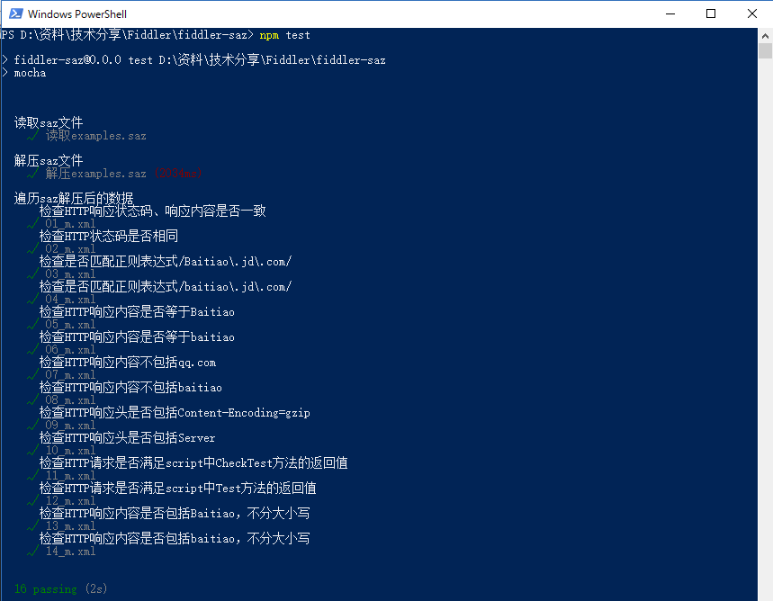

# 用途
根据fiddler存档文件(.saz文件)，编写自动化测试脚本。

# 说明
请将.saz文件放到项目根目录下，命名为examples.saz，便可运行起来该项目的测试脚本。  

# 注意事项
运行测试脚本过程中请注意：
1. 可以先运行```mocha test/saz.unzip.spec.js```解压saz文件到fiddler目录中;
2. 可以直接运行``` npm test```，得到下述测试结果：
